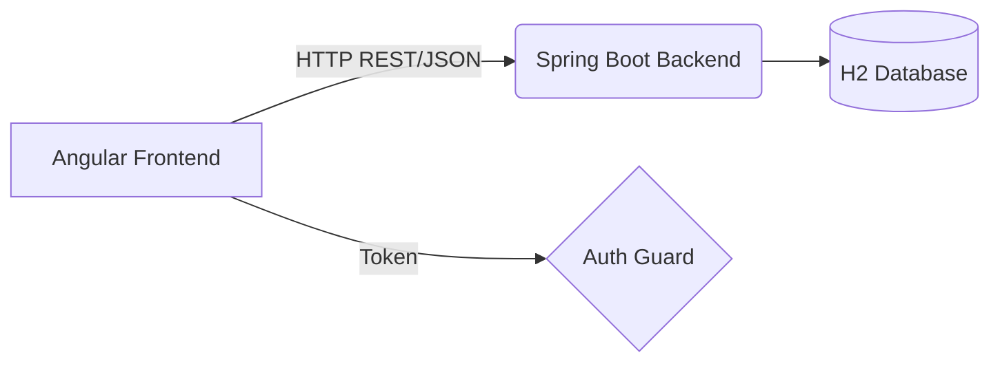

# User Management System

A full-stack web application for comprehensive user management, developed as part of an assignment to demonstrate modern web development practices. This project features a robust backend API built with Spring Boot and a dynamic, responsive single-page application built with Angular.

## 1. Project Title
**Project Name**: User Management System  
**Description**: A full-stack application providing secure authentication, user CRUD operations, and an interactive UI with Angular Material.  
**Assignment**: Phase 13 – Project Documentation

## 2. Project Overview
This application provides an end-to-end user management solution. It allows authorized personnel to securely log in, view a list of users, create new users, update existing user details, and delete users. The primary business objective is to provide a clean, secure, and maintainable foundation for managing entities within an organization.

**User Flow**:
1. User arrives at the application and is presented with a Login screen.
2. Upon successful authentication, the user is redirected to the Dashboard/Users list.
3. The user can view, search, and manage user records via dedicated Create/Edit forms and delete confirmations.

## 3. Technology Stack

**Backend**:
- Java 21
- Spring Boot 4.1.0
- Spring Data JPA
- Hibernate
- Maven
- H2 Database (File-based)

**Frontend**:
- Angular 21.2.0
- Angular Material 21.2.14
- RxJS
- TypeScript
- SCSS

**Development Tools**:
- Node.js & npm
- Git & GitHub
- Postman (for API testing)
- IDE (IntelliJ IDEA / VS Code)

## 4. Architecture Overview
The application follows a standard separated presentation architecture. The frontend is a Single Page Application (SPA) communicating via RESTful APIs to the backend.

- **Backend Architecture**: Layered architecture comprising Controllers (handling HTTP requests), Services (business logic), Repositories (database interactions via Spring Data JPA), and Entities (domain models).
- **Frontend Architecture**: Component-driven architecture using Angular. State and data are managed through central Services, while Guards protect routes.
- **Authentication Flow**: The user submits credentials to the backend. Upon validation, the backend issues a token (simulated JWT/UUID). The frontend stores this token and attaches it to subsequent requests via an HTTP Interceptor.



## 5. Folder Structure

### Backend
- `controller/`: REST API endpoints handling incoming requests.
- `service/`: Business logic and data processing.
- `repository/`: Spring Data JPA interfaces for database operations.
- `entity/`: JPA entities representing database tables.
- `dto/`: Data Transfer Objects for request/response payloads.
- `security/`: Security utilities and authentication configuration.
- `exception/`: Global error handling and custom exceptions.
- `config/`: Application configuration classes.

### Frontend
- `core/`: Singleton services, guards, and interceptors (e.g., Auth, Error handling).
- `shared/`: Reusable UI components (Loader, Empty State, Search Box), pipes, and directives.
- `pages/`: Feature modules and routed components (Login, Users, Dashboard, etc.).
- `models/`: TypeScript interfaces and types for data structures.
- `environments/`: Environment-specific configuration variables.
- `assets/`: Static files like images and icons.

## 6. Installation Guide

### Backend Setup
1. **Navigate to the backend directory**:
   ```bash
   cd backend
   ```
2. **Run the application**:
   ```bash
   ./mvnw spring-boot:run
   ```
   *Maven will automatically download the required dependencies. The database is configured as an embedded H2 file database, so tables will be auto-created and no external DB setup is required.*

### Frontend Setup
1. **Navigate to the frontend directory**:
   ```bash
   cd frontend
   ```
2. **Install dependencies**:
   ```bash
   npm install
   ```
3. **Run the application**:
   ```bash
   npm start
   ```
   *The frontend will start on `http://localhost:4200` and proxy API requests to the backend.*

## 7. Required Versions
- **Java**: 21
- **Spring Boot**: 4.1.0
- **Angular / Angular CLI**: 21.2.0+
- **Node.js**: 20+
- **npm**: 10.9+
- **Maven**: Bundled Wrapper (mvnw)

*Compatibility Note: Ensure Node.js and Angular CLI versions match to prevent build errors.*

## 8. Environment Configuration
- **Backend**: Configuration is managed in `src/main/resources/application.properties`. It contains the server port (`8080`), database URL (`jdbc:h2:file:./data/usermanagementdb`), and default admin credentials.
- **Frontend API URL**: API calls are routed via `proxy.conf.json` in development to avoid CORS issues, mapping `/api` to `http://localhost:8080`.

## 9. Available Commands

### Backend (Maven)
- `./mvnw clean install` - Build the project and run tests.
- `./mvnw spring-boot:run` - Start the Spring Boot server.
- `./mvnw test` - Run unit tests.

### Frontend (npm / Angular CLI)
- `npm install` - Install Node modules.
- `ng serve` or `npm start` - Start the development server.
- `ng build` - Build the project for production.
- `ng test` - Run frontend unit tests.

## 10. Authentication
- **Default Credentials**: You can log in using the following default admin credentials:
  - **Username**: `admin`
  - **Password**: `admin123`
- **Login Flow**: The user enters their credentials on the login page.
- **JWT Authentication / Token Storage**: On successful login, the server responds with a secure token. This token is stored securely in the browser's storage.
- **Authorization Header**: An Angular `HttpInterceptor` automatically attaches the token as a Bearer token to the `Authorization` header of all outgoing API requests.
- **Route Protection**: Angular Route Guards (`AuthGuard`) prevent unauthenticated users from accessing protected pages like the Dashboard or Users list.
- **Logout**: Clears the stored token and redirects the user back to the login page.

## 11. API Documentation

### Authentication APIs
- **POST** `/api/auth/login`
  - **Description**: Authenticates a user and returns a token.
  - **Auth Required**: No
  - **Request Body**: `{ "username": "...", "password": "..." }`
  - **Response**: `{ "success": true, "message": "...", "data": "<token>" }`

### User Management APIs
- **GET** `/api/users`
  - **Description**: Retrieves a list of all users.
  - **Auth Required**: Yes
  - **Response**: Array of User objects.
- **GET** `/api/users/{id}`
  - **Description**: Retrieves details of a specific user.
  - **Auth Required**: Yes
  - **Response**: User object.
- **POST** `/api/users`
  - **Description**: Creates a new user.
  - **Auth Required**: Yes
  - **Request Body**: User object.
  - **Response**: Created User object.
- **PUT** `/api/users/{id}`
  - **Description**: Updates an existing user.
  - **Auth Required**: Yes
  - **Request Body**: Updated User object.
  - **Response**: Updated User object.
- **DELETE** `/api/users/{id}`
  - **Description**: Deletes a user by ID.
  - **Auth Required**: Yes

## 12. User Interface Overview
- **Login Page**: A clean, centered card with a reactive form for username and password.
- **Dashboard / Users Page**: A data table displaying all users. Includes a search box and action buttons.
- **Create/Edit User**: A shared form component handling both creation and modification of user data with real-time validation.
- **Delete Confirmation**: A modal or dialog to confirm deletion actions, preventing accidental data loss.
- **Empty State**: Visual feedback when no users exist in the database or match the search criteria.
- **Loading Spinner**: A global or localized loader displayed during network requests.
- **404 Page**: A friendly "Not Found" page for unrecognized routes.

## 13. Folder Architecture
- **Backend Layering**: Follows standard Spring Boot conventions to separate concerns. Controllers handle HTTP, Services handle logic, Repositories handle data.
- **Frontend Modularization**: 
  - `core/`: Contains singletons and essential app-wide configuration (Interceptors, Guards).
  - `shared/`: Contains components used across multiple pages (Buttons, Loaders), keeping the codebase DRY (Don't Repeat Yourself).
  - `pages/`: Contains smart components that represent distinct views or routes.

## 14. Design Decisions
- **Angular Material**: Chosen for its robust, accessible, and pre-styled UI components, significantly speeding up development while ensuring a professional look.
- **Reactive Forms**: Used for complex form validations, allowing for a scalable and programmatic approach to managing form state.
- **Functional Guards (`CanActivateFn`)**: Chosen over class-based guards because functional guards are the modern, recommended approach in recent Angular versions. They provide a more concise syntax, eliminate the boilerplate of creating a class with dependency injection, and are easier to test and compose as simple functions.
- **Shared Create/Edit Component**: Instead of duplicating code for adding and updating users, a single form component was built to handle both contexts based on the routing parameters.
- **Centralized HTTP Interceptor**: Simplifies API calls by automatically appending tokens and handling global errors in one place.
- **SOLID Principles**: Adhered to by keeping classes and components focused on a single responsibility.

## 15. Error Handling
- **Client Validation**: Angular Reactive Forms provide instant feedback on required fields, formats, etc.
- **Server Validation**: Spring Boot validates incoming DTOs using `@Valid` and returns appropriate 400 Bad Request responses.
- **HTTP Status Handling**: The frontend interceptor catches API errors (401, 403, 404, 500).
- **Snackbar Notifications**: Errors and success messages are displayed to the user via non-intrusive toast notifications (Angular Material Snackbar).

## 16. Security
- **JWT / Token Authentication**: Secures APIs by requiring a valid token.
- **Authorization Header**: Used to transmit tokens securely via HTTP headers.
- **Route Guards**: Prevent unauthorized access to frontend routes.
- **Protected APIs**: Backend endpoints (except login) require an authenticated context.
- **Input Validation**: Both frontend and backend validate input to prevent malicious data injection.

## 17. Assignment Mapping

| Assignment Requirement | Implementation |
| ---------------------- | -------------- |
| Login Authentication   | Completed      |
| CRUD Operations        | Completed      |
| Shared Create/Edit Form| Completed      |
| Angular Material Table | Completed      |
| Auth Route Guard       | Completed      |
| API Interceptors       | Completed      |
| Global Error Handling  | Completed      |

## 18. Learning Notes
During the development of this project, several key concepts were reinforced:
- **Angular Architecture**: Deepened understanding of component communication, Route Guards, and the importance of a well-structured `core` and `shared` module.
- **Spring Boot APIs**: Gained practical experience in building clean REST APIs, utilizing DTOs to separate domain models from API contracts.
- **Reactive Forms**: Mastered the use of `FormBuilder` and custom validators to create dynamic, responsive forms.
- **Error Handling**: Learned how to effectively use HTTP Interceptors to catch and manage errors globally without cluttering component logic.

## 19. Laravel vs Spring Boot Reflection

### Main differences I noticed
- **Project structure**: Laravel is very straightforward and feels quick to work with. Java (Spring Boot) has more layers like controllers, services, repositories, and entities, so understanding the project structure took time.
- **Type system**: PHP is more flexible, while Java is strongly typed. In Java, I had to pay more attention to data types, method signatures, and class design.
- **Code style**: Java uses object-oriented programming more strictly. I had to understand concepts like interfaces, dependency injection, and annotations, which I didn't use as much in Laravel.
- **Configuration**: Laravel works with many things out of the box. In Java, I had to learn how different configurations and dependencies work together.

### How I figured it out
- **Official documentation**: Whenever I didn't understand a concept, I first checked the official documentation. It helped me understand how things are supposed to work instead of just copying code.
- **Using AI as a guide**: I used AI to explain concepts in simple language, create a learning plan, and break difficult topics into smaller steps. Instead of asking for complete solutions, I used it to understand the logic behind the code.

## 20. Future Improvements
- **Role Management**: Add fine-grained roles and permissions (Admin, User, Manager).
- **Pagination and Sorting**: Implement server-side pagination for the users list to handle large datasets efficiently.
- **Audit Logs**: Track who created, updated, or deleted records.
- **Unit & Integration Tests**: Expand the test suites for both frontend and backend.
- **Dockerization**: Add `Dockerfile` and `docker-compose.yml` for seamless deployment.

## 21. Troubleshooting
- **Port Conflicts**: If port `8080` (Backend) or `4200` (Frontend) is in use, change the port in `application.properties` or by running `ng serve --port 4201`.
- **Database Connection**: Since it uses H2 in-memory/file DB, ensure the backend has write permissions to the `./data` directory.
- **Angular Version Mismatch**: If `npm install` fails with peer dependency errors, try `npm install --legacy-peer-deps`.
- **JWT / Token Configuration Issues**: Ensure the frontend is properly appending the `Authorization` header to requests.
- **CORS Issues**: Ensure the backend is running, and the frontend is started using the proxy configuration.

## 22. License
This project is created for educational and assignment purposes. It is provided "as is" without warranty of any kind.
